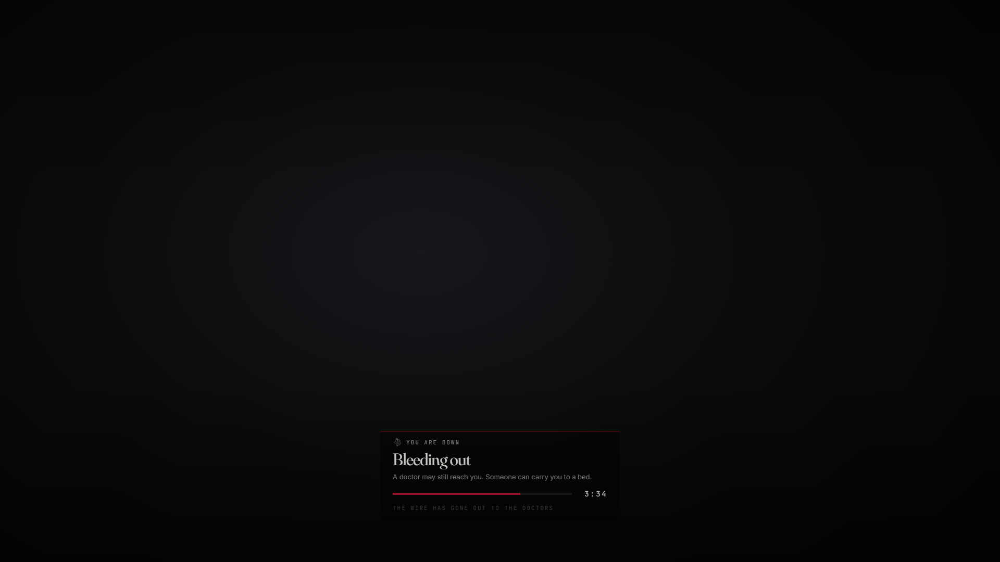

# lxr-doctor — Death, bleeding out and coming back, for LXRCore

When a character goes down they lie where they fell with a timer. A doctor
on duty can reach them (lxr-dispatch hears every fall), a stranger can drag
them to a bed, or the timer runs out and they wake in the nearest doctor's
office lighter by the fee. Doctors treat wounds with catalog medicine; the
office bed treats anyone for a price when no doctor is about. Every job of
type `medical` in the core registry is a doctor here.



## What it does

* **Down** — the client notices the ped dying and reports once; the server
  stamps the time, marks `isdead` in core metadata (survives relogs), sets
  the `dead` state bag, emits `lxr:player:died` and raises a `10-52` when a
  doctor is on duty. The body stays in the wounded pose, controls off, the
  death card counts `Config.Death.bleedOutSeconds`.
* **Back** — a doctor's revive (progress bar, consumes `bandage_clean`,
  `reviveHealth`); the office bed (fee, full health, only when no doctor of
  that office is on duty); or letting go after the timer at the nearest
  office for `respawnFee` (guns leave the hands through lxr-weapons).
* **Treatment** — a doctor picks medicine from what they carry
  (`Config.Doctors.treatItems`); the catalog's `effects.health` becomes ped
  health.
* **Injuries** — every hard hit lands on a body part (the game's last-damage bone → head, torso, arms, legs, from the game's own bone lists in `shared/bones.lua`): hurt, then broken; a heavy hit may open a bleed. Hurt legs slow the walk (`SetPedMoveRateOverride`), a broken head blacks out now and then, a bleed costs health per tick — sooner while moving — until it is dressed. A bandage from the satchel stops a bleed (and heals as before); a doctor's **Examine** shows the patient's parts and bleed, **Treat** asks which part a splint or clean bandage mends, a tonic mends everything. `/injuries` shows your own. State lives in character metadata `injuries` and the `injured` state bag; `Config.Injuries`, `/setinjury id part level` (admin), exports `GetInjuries / SetInjuries`.
* **Waking at the office** — the wait is shorter when no doctor is on duty (`bleedOutNoDoctors`); `Config.Death.wipe` can take the satchel (minus `keep`) and the cash.
* **Cabinet** — an lxr-inventory stash per office for its jobs (`Config.Doctors.storage`).
* **Duty** — at the office desk. Offices carry blips.
* **Events** — `lxr:player:died (src, cause)`, `lxr:player:revived (src,
  reason)`, `lxr:doctor:treated (target, doctor, item, heal)`.

## Install

```cfg
ensure lxr-core
ensure lxr-nui
ensure lxr-inventory
ensure lxr-interact
ensure lxr-doctor
```

lxr-dispatch and lxr-weapons are used when running. No SQL.

## Configuration

`config.lua` — `Config.Lang`, `Config.Death`, `Config.Doctors`,
`Config.Offices`, `Config.Bed`, `Config.Security`.

## API

| Name | Side | Purpose |
|---|---|---|
| `IsDead(src)` · `Revive(src, health)` · `Kill(src, reason)` · `DoctorsOnDuty()` | server | other resources' hooks |
| `Player(src).state.dead / diedAt` | both | replicated state |
| `IsDown()` · `IsDoctor()` | client | local mirror |

## Licence

© 2026 iBoss21 / LXRCore — All Rights Reserved. See `LICENSE`.
